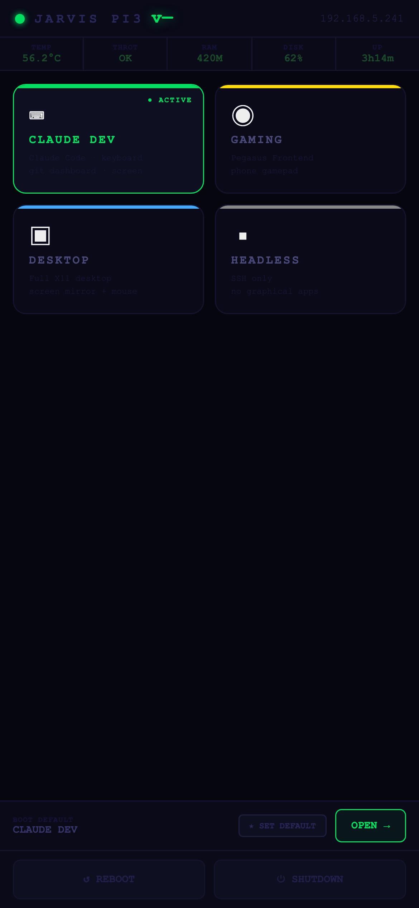
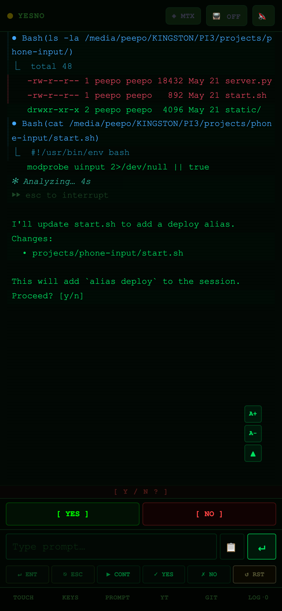
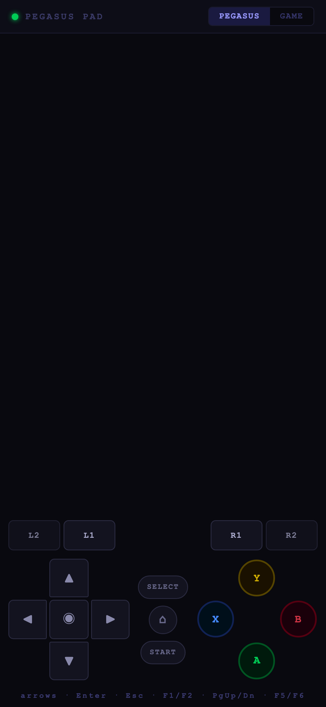

# PI3HUB

Kit de desarrollo para convertir una Raspberry Pi 3 (1 GB de RAM) en una máquina creativa que se controla desde el celular. Es para quien quiere usar una Pi sin teclado ni pantalla, incluyendo Claude Code corriendo en ella.

| Cockpit (cambio de modo) | Claude Code desde el celular | Control de juegos |
| --- | --- | --- |
|  |  |  |

<sub>Capturas tomadas con `mock_server.py` en una laptop, sin Pi real. La sesión de Claude es un ejemplo guionado del mock.</sub>

## Qué incluye

- Servidores Flask que convierten el celular en teclado, mouse, touchpad y gamepad (con `uinput`).
- Cockpit: pantalla única para cambiar de modo (Claude Dev, Gaming, Desktop, Headless), ver la sesión de Claude Code en tmux por SSE, reiniciar o apagar la Pi.
- Pegasus Pad: control para Pegasus Frontend y RetroArch con `xdotool`.
- Tamagotchi: pequeña app Flask con tabla de puntajes en Postgres, lista para Vercel.
- Scripts de instalación (`setup/`) y servicios de systemd para que todo arranque solo.
- Ejemplos en `examples/` (LED, arte generativo, reproductor MIDI, NeoPixel).
- `CLAUDE.md` y `config/phone-ui-rules.md` con las reglas de formato para que las respuestas de Claude se vean bien en pantalla chica.

## Tecnologías

Python, Flask, Flask-Sock, `uinput`, tmux, systemd, shell scripts, Postgres (Tamagotchi).

## Proyectos

| Proyecto | Puerto | Qué hace |
| --- | --- | --- |
| `projects/cockpit` | 5000 | Control unificado desde el celular |
| `projects/phone-input` | 5000 | Celular como mouse, teclado y touchpad |
| `projects/pegasus-pad` | 5001 | Gamepad para Pegasus Frontend |
| `projects/tamagotchi` | n/a | Mascota virtual con leaderboard |

## Cómo correrlo

Probar sin Pi, en cualquier computadora:

```bash
pip install flask flask-sock pillow
python mock_server.py
```

Luego abre `http://localhost:5000`.

En la Pi (Raspberry Pi OS Bookworm):

```bash
bash setup/base.sh
bash setup/remote-access.sh
bash setup/claude-code.sh
bash setup/install-skills.sh
cd projects/cockpit && sudo bash start.sh
```

Para que arranque con el sistema, copia `setup/cockpit.service` a `/etc/systemd/system/` y ejecuta `systemctl enable --now cockpit.service`. Para activar el leaderboard en el cockpit se usa la variable `TAMAGO_URL`.

## Notas

- Con 1 GB de RAM conviene mantener los procesos por debajo de unos 700 MB.
- Los scripts que tocan GPIO o `uinput` necesitan sudo.
